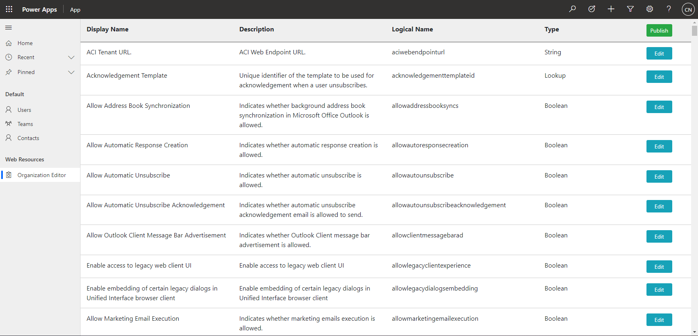
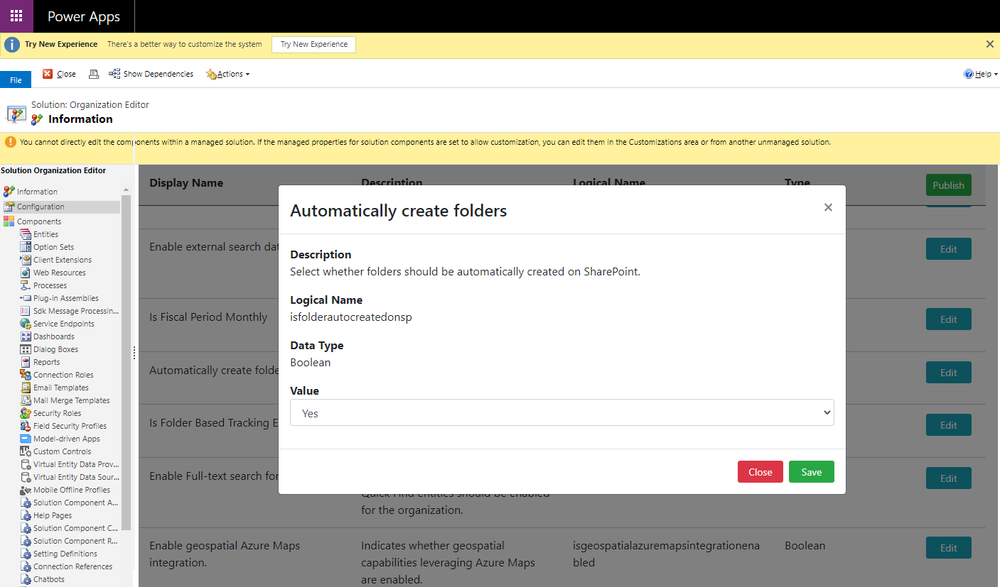

# D365 Organization Editor
Dynamics 365 stores configuration values for the environment in the `Organization` entity. 
These fields are updated when changes are made in the `System > Administration > System Settings` window, although not all settings are present here,

Examples of fields that are not available in the System Settings are:
- __IsFolderAutoCreatedonSP__: Select whether folders should be automatically created on SharePoint.
- __AllowLegacyClientExperience__: Enable access to legacy web client UI
  - This field cannot be changed after fully migrating to unified interface.

This solution provides a way to update the fields in the organization entity without writing a console app.

The fields shown in the editor are retrieved from the metadata, so any fields that are added to the organization entity will be shown.

Some fields cannot be edited, and these fields will not be shown, for example `CreatedOn`.

---

## Caution
**Changing some of these values could break something, so be careful not to break your Dynamics 😃**
(Set the values at your own risk.)

---

## Installation / Usage
- Download the solution from the [Releases page](https://github.com/cathalnoonan/d365-organization-editor/releases)
- Install the solution to the environment
- Open the solution and the WebResource will be open under the `Configuration` section
- Search for the field to update using CTRL+F, click the `Edit` button
- Update the value and click `Save`
- Changing some values require `Publish All Customizations` to reflect 

---

## Building the Solution
_Building the solution assumes that NODE/NPM is installed, dotnet 5.0 is installed and the user has permissions to execute the scripts._

There is a batch script included to bundle the JS and build a solution file, it is called `build.bat` and located at the root of the repository.

This will
- Install the node_modules
- Build and bundle the project files for the browser (to `.\src\temp` folder)
- Build a managed and unmanaged solution (to the `.\dist` folder)

> **Note:**
>
> The equivalent script is also available as `./build.sh` for use on macOS.
